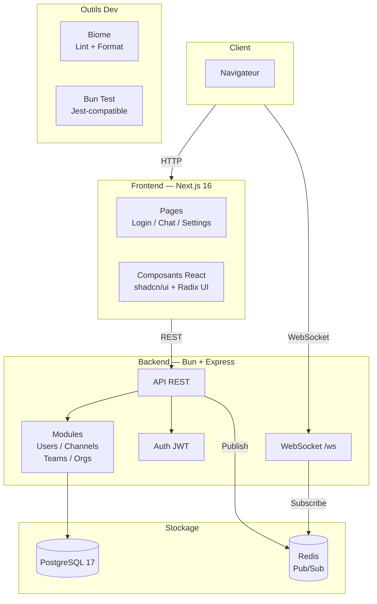

# Architecture

## Vue d'ensemble

Lime est une application de chat en temps réel construite avec une architecture client/serveur classique. Le backend expose une API REST et un endpoint WebSocket, tandis que le frontend est une application Next.js.



## Stack technique

### Backend (`chat-backend/`)

| Technologie | Rôle |
|---|---|
| **Bun** | Runtime TypeScript |
| **Express** | Serveur HTTP / routage REST |
| **express-ws** | Support WebSocket |
| **PostgreSQL** | Persistance des données |
| **Redis** | Pub/Sub temps réel entre instances |
| **JWT + bcrypt** | Authentification |
| **Swagger** | Documentation API |
| **Biome** | Linter / formatter |
| **node-pg-migrate** | Migrations SQL |

#### Modules API REST

| Route | Fichier | Rôle |
|---|---|---|
| `/api/auth` | `auth.ts` | Register, login, logout |
| `/api/users` | `users.ts` | Profil utilisateur |
| `/api/channels` | `channels.ts` | Canaux + messages |
| `/api/org` | `organisations.ts` | Organisations |
| `/api/teams` | `teams.ts` | Équipes |

### Frontend (`chat-client/`)

| Technologie | Rôle |
|---|---|
| **Next.js 16** | Framework React (App Router) |
| **React 19** | UI |
| **Tailwind CSS 4** | Styles |
| **Radix UI + shadcn/ui** | Composants accessibles |
| **lucide-react** | Icônes |
| **class-variance-authority** | Variantes de composants |
| **next-themes** | Thème clair/sombre |
| **Biome** | Linter / formatter |

## Structure du projet

```
lime/
├── chat-backend/
│   ├── src/
│   │   ├── index.ts            # Point d'entrée Express + WebSocket
│   │   ├── database.ts         # Requêtes PostgreSQL (Pool pg)
│   │   ├── redis.ts            # Client Redis pub/sub
│   │   ├── config.ts           # Configuration (JWT secret, etc.)
│   │   ├── auth.ts             # Routes auth (register, login, logout)
│   │   ├── users.ts            # Routes profil utilisateur
│   │   ├── channels.ts         # Routes canaux + messages
│   │   ├── organisations.ts    # Routes organisations
│   │   ├── teams.ts            # Routes équipes
│   │   ├── email.ts            # Envoi d'e-mails
│   │   ├── middleware.ts        # Middlewares Express
│   │   └── swagger.ts          # Définition OpenAPI
│   ├── migrations/              # Migrations SQL (node-pg-migrate)
│   └── package.json
│
├── chat-client/
│   ├── app/
│   │   ├── layout.tsx           # Layout racine (thème, fonts)
│   │   ├── page.tsx             # Page d'accueil / app
│   │   ├── login/page.tsx       # Page de connexion
│   │   ├── chat/page.tsx        # Page de chat
│   │   ├── settings/page.tsx    # Page de paramètres
│   │   └── globals.css          # Styles Tailwind
│   ├── components/              # Composants React (shadcn/ui)
│   ├── lib/                     # Utilitaires (cn, etc.)
│   ├── types/                   # Types TypeScript
│   ├── proxy.ts                 # Proxy de dev vers le backend
│   ├── Dockerfile               # Build de production
│   └── package.json
│
├── compose.yml                  # Docker Compose (PostgreSQL, Redis, Adminer)
├── .env                         # Variables d'environnement
└── package.json                 # Scripts racine (dev, migrate, seed, lint)
```

## Base de données

Les migrations SQL se trouvent dans `chat-backend/migrations/`. Le schéma complet :

### Tables principales

- **users** — Utilisateurs (firstname, lastname, email, username, password)
- **organisations** — Organisations (name, slug, company info)
- **teams** — Équipes liées à une organisation
- **channels** — Canaux de discussion
- **messages** — Messages dans un channel (content, is_updated, is_pinned)
- **documents** — Fichiers attachés aux messages (type, file_path, file_name, file_size)

### Tables de liaison

- **team_users** — Membres d'une équipe
- **channel_team_users** — Accès aux channels (par team ou par user, avec contraintes d'unicité)
- **message_reaction_users** — Réactions sur les messages

### RBAC (Rôles & Permissions)

- **roles** — Rôles (is_admin, is_super_admin)
- **permissions** — Permissions avec action (GET, CREATE, UPDATE, DELETE)
- **role_permissions** — Association rôle ↔ permission
- **user_roles** — Attribution des rôles par scope (global, team, channel)

## Temps réel

Le flux temps réel fonctionne via Redis Pub/Sub :

1. Un client envoie un message via WebSocket ou POST REST
2. Le message est inséré en base PostgreSQL
3. Le message est publié sur le channel Redis `messages`
4. Tous les serveurs abonnés reçoivent le message via Redis
5. Chaque serveur broadcast aux clients WebSocket connectés

Ce mécanisme permet le scaling horizontal : plusieurs instances du backend peuvent tourner derrière un load balancer.

## Authentification

- **Register** `POST /api/auth/register` — Inscription (bcrypt hash du mot de passe)
- **Login** `POST /api/auth/login` — Connexion, retourne un JWT (expire en 24h)
- **Logout** `POST /api/auth/logout` — Déconnexion côté client
- **Profil** `GET /api/users/me` — Récupération du profil utilisateur connecté

## Infrastructure locale

Docker Compose fournit les services :

| Service | Port | Description |
|---|---|---|
| PostgreSQL | 5432 | Base de données |
| Redis | 6379 | Pub/Sub temps réel |
| Adminer | 8081 | Interface web pour la DB |

## Infrastructure de production

En production, le frontend, le backend et Redis sont hébergés sur **Render**, et la base PostgreSQL est managée par **Neon** (externe à Render). Configuration détaillée (URLs, variables d'environnement, migrations au démarrage) : [deploiement.md](deploiement.md).

## Historique des choix techniques

Les détails sur les technologies évaluées avant d'arriver à cette stack (SurrealDB, SpacetimeDB) sont documentés dans [architecture-legacy.md](architecture-legacy.md).
