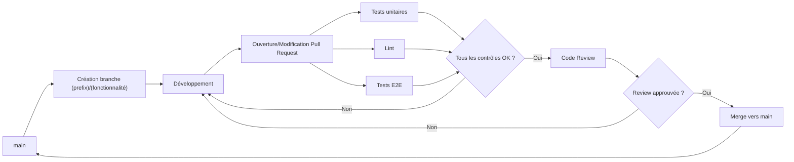
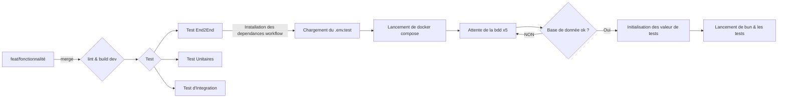

# Guide de bonne pratiques

## Stratégies de préfixes et Gitflow

Pour notre gitflow nous allons utiliser les préfixes suivant

| prefix | Description                                            |
| ------ | ------------------------------------------------------ |
| feat   | Nouvelle fonctionnalitée                               |
| fix    | Réglage d'un bug utilisateur                           |
| docs   | changement dans la documentation                       |
| ref    | Refactorisation du code / amelioration de performances |
| style  | modification d'elements stylistiques                   |
| typo   | Modification de textes                                 |
| test   | Ajout / modification de test applicatifs               |
| chore  | tache de maintenances                                  |

#### formatage des commits

- Tout les commits doivent réutiliser les préfixes autorisés
- le message doit être rédiger en français sans accents de préférence

`(prefix): <description>`
Exemple :  `feat: Ajout de la page de connexion`

### Stratégie de branches

| Branche                     | Description                                            |
| --------------------------- | ------------------------------------------------------ |
| main                        | Branche principale, push directes interdits            |
| <prefix\>/<fonctionnalitée> | branche contenant une fonctionnalitée en developpement |

Les préfixes de commit peuvent êtres utiliser a la place de feat lorsque la modification correspond uniquement un aspect
ex `typo/homepage` pour une branches contenant de multiples modification de la page d'accueil

## Architecture du pipeline CI/CD



Les commits sont fait sur des branches correctement nommées ([[#Stratégies de préfixes et Gitflow]])
Une fois les branches complétés, une pull request est ouverte, les workflow de test e2e, lint, review agent se lancent automatiquement. Si le tests sont validés, Un de nous deux review le code, si il est validé il est merge dans la main.

### Architecture de lancement des tests



### Code review et acceptation de merge

A chaque pull request coderabbit déclenche sa propre code review en même temps que les autres actions, la review coderabbit[^2] va nous permettre de modifier nos pull request en fonction de la pertinence des changements proposés et leur impacte.
    En parallèle la personne qui n'a pas rédigé la pull request sera sollicitée comme Reviewer des changement.

## Environnement de test e2e

Lors de la création d'une pull request une pipeline ci lance parallèlement les test via le workflow `test.yml`. Ce workflow initialise une environnement de test avec des valeurs prédéfinis afin de vérifier l'intégration du projet sur un environnement.

##### Son fonctionnement

La pipeline, installe toutes les actions nécessaire a son fonctionnement. Une fois les actions installés, la pipeline copie le fichier `env.test`, une fois le fichier `env.test` copier, la pipeline va lancé un docker compose de la base de donnée postgres et le redis. Ensuite, la pipeline va vérifier l'état de lancement des deux services, lorsqu'ils sont confirmés comme lancé, la pipeline va lancer bun et exécuté les test e2e[^1].

## Structure du projet

```sh  
.  
├── .github/  
│ ├── workflows/  
| | ├──  test.yml # Piple CI de tests 
│ │ └──  lint.yml # Pipeline CI de linting 
| 
├── chat-backend/  
│ ├── __test__/ # dossiers contenant les tests backend
│ │ └── api.test.ts # Tests d'intégration/API  
│ ├── migrations/ # Migrations de base de données  
│ ├── src/ # Code source principal du backend  
│ ├── .env.example # Variables d'environnement d'exemple  
│ ├── .env.test # Variables d'environnement pour les test 
│ ├── .gitignore  
│ ├── biome.json # Configuration Biome (lint + format)  
│ ├── bun.lock # Verrouillage des dépendances Bun  
│ ├── package.json # Dépendances et scripts backend  
│ ├── seed.ts # Script d'initialisation des données  
│ └── tsconfig.json
|
├── chat-client/  
│ ├── app/ # Routes et pages de l'application  
│ ├── components/ # Composants UI réutilisables  
│ ├── lib/ # Utilitaires, services et helpers  
│ ├── public/ # Assets 
│ ├── types/  
│ ├── .env.example # Variables d'environnement d'exemple  
│ ├── .gitignore  
│ ├── biome.json # Configuration Biome  
│ ├── bun.lock  
│ ├── package.json # Dépendances et scripts frontend  
│ ├── proxy.ts # Configuration du proxy/reverse proxy  
│ └── README.md # Documentation du client   
├── docs/ # Documentation du projet  
├── .coderabbit.yml # Configuration CodeRabbit  
├── .env.example # Variables d'environnement globales  
├── .gitignore  
├── compose.yml # Orchestration Docker Compose  
├── CONTRIBUTING.md # Guide de contribution  
├── package.json # Scripts et dépendances racine  
├── README.md # Documentation principale  
└── run.ts # Point d'entrée / script d'exécution  
```

## Possibilité d'évolution

Pour l'évolution de notre projet nous pourrions mettre en place une coordination avec ouverture d'issue dans l'onglet projet du repository afin d'organiser les issue regler a partir du kanban fournie.

## Note de bas de page

[^1]: Test E2E : Le test de bout en bout (E2E) est une méthodologie de test logiciel qui valide l'ensemble du flux de travail applicatif du début à la fin [(source: IBM)](https://www.ibm.com/think/topics/end-to-end-testing)

[^2]: Coderrabbit : Agent de review par intelligence artificiel

# Auteurs

[Erwan](https://github.com/ClubEpice) :
[@Adryan](https://github.com/aydryun) :
