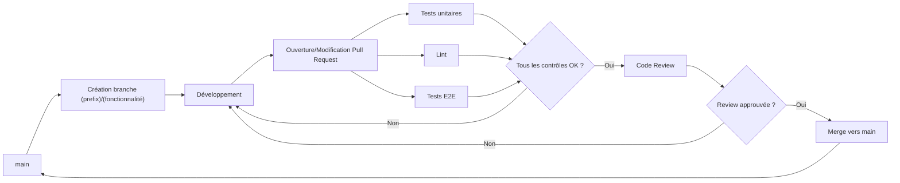
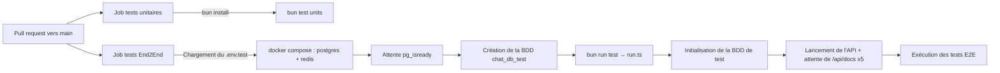

# Guide de bonne pratiques

## Stratégies de préfixes et Gitflow

Pour notre gitflow nous allons utiliser les préfixes suivant

| prefix | Description                                            |
| ------ | ------------------------------------------------------ |
| feat   | Nouvelle fonctionnalitée                               |
| fix    | Réglage d'un bug utilisateur                           |
| docs   | changement dans la documentation                       |
| ref    | Refactorisation du code / amelioration de performances |
| style  | modification d'elements stylistiques                   |
| typo   | Modification de textes                                 |
| test   | Ajout / modification de test applicatifs               |
| chore  | tache de maintenances                                  |

#### formatage des commits

- Tout les commits doivent réutiliser les préfixes autorisés
- le message doit être rédiger en français sans accents de préférence

`(prefix): <description>`
Exemple :  `feat: Ajout de la page de connexion`

### Stratégie de branches

| Branche                     | Description                                            |
| --------------------------- | ------------------------------------------------------ |
| main                        | Branche principale, push directes interdits            |
| <prefix\>/<fonctionnalitée> | branche contenant une fonctionnalitée en developpement |

Les préfixes de commit peuvent êtres utiliser a la place de feat lorsque la modification correspond uniquement un aspect
ex `typo/homepage` pour une branches contenant de multiples modification de la page d'accueil

## Conventions de nommage du code

Au-delà des conventions Git, le code suit des règles de nommage et de style homogènes, imposées automatiquement par **Biome** (lint + format) sur le backend comme le frontend :

- **camelCase** pour les variables, fonctions et propriétés (TypeScript/JavaScript) ; **PascalCase** pour les composants React et les types.
- **Fichiers backend nommés par domaine métier** (`auth.ts`, `organisations.ts`, `teams.ts`, `channels.ts`, `users.ts`).
- **Pas de `any`** : la règle `noExplicitAny` est en `error` dans [`biome.json`](../chat-backend/biome.json), le typage explicite est obligatoire.
- **Guillemets doubles**, indentation à 2 espaces, et **imports organisés automatiquement** (`organizeImports`).

Le formatage n'est donc pas laissé à l'appréciation de chacun : `bun run check` applique les règles localement et le workflow `lint.yml` les vérifie sur chaque pull request.

## Architecture du pipeline CI/CD



Les commits sont fait sur des branches correctement nommées ([[#Stratégies de préfixes et Gitflow]])
Une fois les branches complétés, une pull request est ouverte, les workflow de test e2e, lint, review agent se lancent automatiquement. Si le tests sont validés, Un de nous deux review le code, si il est validé il est merge dans la main.

Les workflows de test et de lint sont automatiquement ignorés sur les branches de documentation (`docs/*`), qui ne modifient pas le code applicatif.

### Architecture de lancement des tests

Les tests sont répartis en deux jobs indépendants dans le workflow `test.yml` : les **tests unitaires** (`bun test units`) et les **tests End2End** (orchestrés par `__test__/run.ts`). Les deux jobs sont ignorés sur les branches `docs/*`.



### Code review et acceptation de merge

À chaque pull request, **CodeRabbit**[^2] déclenche sa propre code review en parallèle des workflows de lint et de test. Ses suggestions nous permettent d'ajuster la pull request selon la pertinence et l'impact des changements. En parallèle, la personne qui n'a pas rédigé la pull request est sollicitée comme *reviewer* humain.

CodeRabbit est configuré via [`.coderabbit.yml`](../.coderabbit.yml) :

- **Revues en français** (`language: fr`), profil `chill`, adaptées à notre stack (Bun, Biome, Next.js App Router + React 19 + Tailwind v4). Des **instructions par chemin** distinguent le backend (règles Biome, pas de `any`) du frontend (patrons React modernes, conventions Tailwind v4).
- **Revue automatique et incrémentale** à chaque PR (et à chaque nouveau commit) : résumé de haut niveau, walkthrough, diagrammes de séquence, estimation de l'effort de revue, évaluation des issues liées.
- **Non bloquante** : `request_changes_workflow: false` et `fail_commit_status: false` — CodeRabbit ne bloque pas le merge, ses retours sont indicatifs (c'est la review humaine + les checks lint/test qui conditionnent le merge). Les *pre-merge checks* (docstrings, qualité du titre/description) sont en mode `warning`.
- **Outils branchés** : Biome, détection de secrets (Gitleaks, TruffleHog), analyse de sécurité (Semgrep, Trivy, Checkov), lint des workflows (actionlint) et Dockerfiles (Hadolint), Markdown (markdownlint), orthographe/grammaire (LanguageTool), SQL (sqlfluff), YAML (yamllint), etc.
- La documentation (`docs/**`) et `node_modules` sont **exclus** des revues (`path_filters`).

## Stratégie de tests

Le projet distingue deux niveaux de tests, tous deux exécutés automatiquement à chaque pull request (voir [[#Architecture de lancement des tests]]) :

- **Tests unitaires** (`__test__/units/`) : ils valident des fonctions isolées, sans dépendance externe ni base de données — helpers de chaîne (`cleanString`), génération de token d'activation, parsing de paramètres (`parseIdParam`), validation des champs d'organisation, middleware d'authentification.
- **Tests End2End / d'intégration** (`__test__/e2e/`) : ils valident les parcours complets à travers l'API réelle et une **base de données de test dédiée** (`chat_db_test`), isolée de la base de développement. Chaque domaine a sa suite : authentification, organisations, équipes, canaux, et sécurité (isolation multi-tenant, anti-escalade de privilèges).

Les données de test sont réinitialisées avant chaque exécution à partir de `fixtures.json` et du script `setup/init-db.ts`, ce qui garantit des tests reproductibles.

**Ce qu'il aurait fallu compléter** — conformément à l'esprit de l'exercice, nous identifions deux limites : nous ne mesurons pas encore d'**objectif de couverture chiffré** (il faudrait instrumenter la couverture et fixer un seuil minimal vérifié en CI), et le **frontend ne dispose pas de tests automatisés** (des tests de composants et un test end-to-end navigateur seraient à ajouter).

## Environnement de test e2e

Lors de la création d'une pull request une pipeline ci lance parallèlement les test via le workflow `test.yml`. Ce workflow initialise une environnement de test avec des valeurs prédéfinis afin de vérifier l'intégration du projet sur un environnement.

##### Son fonctionnement

La pipeline, installe toutes les actions nécessaire a son fonctionnement. Une fois les actions installés, la pipeline copie le fichier `env.test`, une fois le fichier `env.test` copier, la pipeline va lancé un docker compose de la base de donnée postgres et le redis. Ensuite, la pipeline va vérifier l'état de lancement des deux services, lorsqu'ils sont confirmés comme lancé, la pipeline va lancer bun et exécuté les test e2e[^1].

## Architecture modulaire

Le code est organisé selon le principe « **un module = une responsabilité** ».

**Backend** (`chat-backend/src/`) — découpage **par domaine métier**, chaque fichier exposant les routes et la logique d'un domaine :

- `auth.ts` — authentification (connexion, activation de compte, JWT) ;
- `organisations.ts` — gestion des organisations (frontière multi-tenant stricte) ;
- `teams.ts` — hiérarchie d'équipes et cascade d'autorité ;
- `channels.ts` — canaux et messages ;
- `users.ts` — utilisateurs et rôles.

Les préoccupations transverses sont isolées à part : `database.ts` (accès et requêtes), `middleware.ts` (authentification des requêtes), `redis.ts` (cache / sessions), `email.ts` (envoi de mails), `config.ts` (configuration), `swagger.ts` (documentation OpenAPI) et `index.ts` (point d'entrée et montage des routes).

**Frontend** (`chat-client/`) — architecture Next.js App Router : `app/` pour les routes et pages, `components/` pour les composants UI réutilisables, `lib/` pour les utilitaires et services (appels API) et `types/` pour les types partagés.

## Structure du projet

```sh  
.  
├── .github/  
│ ├── workflows/  
| | ├──  test.yml # Piple CI de tests 
│ │ └──  lint.yml # Pipeline CI de linting 
| 
├── chat-backend/  
│ ├── __test__/ # Tests backend (orchestrés par run.ts)
│ │ ├── e2e/ # Tests de bout en bout par domaine (auth, org, teams, channels, sécurité)
│ │ ├── units/ # Tests unitaires (helpers, validation, middleware d'authentification)
│ │ ├── setup/ # Initialisation de la BDD de test (init-db.ts)
│ │ ├── fixtures.json # Jeu de données de test
│ │ └── run.ts # Orchestrateur : prépare la BDD, lance l'API, exécute les tests E2E
│ ├── migrations/ # Migrations de base de données  
│ ├── src/ # Code source principal du backend  
│ ├── .env.example # Variables d'environnement d'exemple  
│ ├── .env.test # Variables d'environnement pour les test 
│ ├── .gitignore  
│ ├── biome.json # Configuration Biome (lint + format)  
│ ├── bun.lock # Verrouillage des dépendances Bun  
│ ├── Dockerfile # Image Docker du backend  
│ ├── package.json # Dépendances et scripts backend  
│ ├── seed.ts # Script d'initialisation des données  
│ └── tsconfig.json
|
├── chat-client/  
│ ├── app/ # Routes et pages de l'application  
│ ├── components/ # Composants UI réutilisables  
│ ├── lib/ # Utilitaires, services et helpers  
│ ├── public/ # Assets 
│ ├── types/  
│ ├── .env.example # Variables d'environnement d'exemple  
│ ├── .gitignore  
│ ├── AGENTS.md # Instructions pour les agents IA  
│ ├── biome.json # Configuration Biome  
│ ├── bun.lock  
│ ├── components.json # Configuration des composants (shadcn/ui)  
│ ├── Dockerfile # Image Docker du frontend  
│ ├── next.config.ts # Configuration Next.js  
│ ├── package.json # Dépendances et scripts frontend  
│ ├── postcss.config.mjs # Configuration PostCSS / Tailwind  
│ ├── proxy.ts # Configuration du proxy/reverse proxy  
│ ├── tsconfig.json  
│ └── README.md # Documentation du client   
├── docs/ # Documentation du projet  
├── .coderabbit.yml # Configuration CodeRabbit  
├── .env.example # Variables d'environnement globales  
├── .gitignore  
├── compose.yml # Orchestration Docker Compose  
├── CONTRIBUTING.md # Guide de contribution  
├── package.json # Scripts et dépendances racine  
├── README.md # Documentation principale  
└── run.ts # Point d'entrée / script d'exécution  
```

## Documentation technique

La documentation technique minimale est présente dans le dépôt et maintenue à jour :

- **Installation et lancement** : [README racine](../README.md) et [README du client](../chat-client/README.md).
- **Endpoints de l'API** : documentés dans [`docs/api-routes.md`](api-routes.md) et exposés de façon interactive via **Swagger** à l'URL `/api/docs` (générée depuis `src/swagger.ts`).
- **Schéma de la base de données** : [`docs/database/database.md`](database/database.md), accompagné du schéma exportable (`database-schema.drawio`, `schema-db.pdf`).
- **Documentation complémentaire** : [architecture](architecture.md), [stack technique](stack.md), [fonctionnalités](fonctionnalites.md) et [déploiement](deploiement.md).

## Possibilité d'évolution

Pour l'évolution de notre projet nous pourrions mettre en place une coordination avec ouverture d'issue dans l'onglet projet du repository afin d'organiser les issue regler a partir du kanban fournie.

## Note de bas de page

[^1]: Test E2E : Le test de bout en bout (E2E) est une méthodologie de test logiciel qui valide l'ensemble du flux de travail applicatif du début à la fin [(source: IBM)](https://www.ibm.com/think/topics/end-to-end-testing)

[^2]: Coderrabbit : Agent de review par intelligence artificiel

# Auteurs

[Erwan](https://github.com/ClubEpice) :
[@Adryan](https://github.com/aydryun) :
