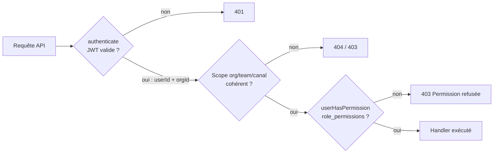
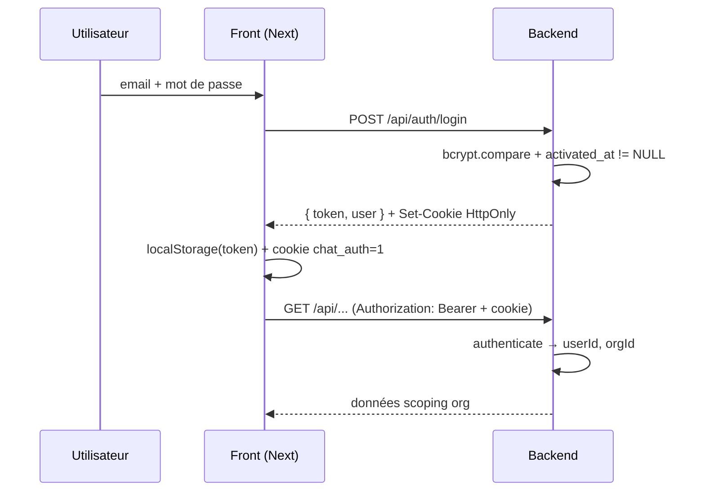

# Sécurité

Cette page décrit les mécanismes de sécurité **réellement implémentés** dans Lime :
authentification, gestion des sessions, autorisation RBAC, cloisonnement
multi-tenant, ainsi que les points d'attention connus. Elle est à jour du code
(`chat-backend/src/`, `chat-client/lib/`).

## Principes

Lime est une application **multi-tenant** : l'**organisation** (`organisations`)
est la frontière d'isolation stricte. Un utilisateur appartient à une seule org,
et toute donnée (équipes, canaux, messages) est rattachée à une org. Deux couches
de contrôle se cumulent sur chaque requête API :

1. **Authentification** — qui es-tu ? (JWT vérifié par `authenticate`)
2. **Autorisation** — as-tu le droit, dans ce scope ? (RBAC via `userHasPermission`)



## Authentification

### Mots de passe

- Hachés avec **bcrypt** (`bcryptjs`), facteur de coût **10**, au register
  comme à l'activation ([auth.ts](../chat-backend/src/auth.ts)).
- Comparaison en temps constant via `bcrypt.compare`.
- Longueur minimale de **8 caractères** imposée à l'activation
  (`MIN_PASSWORD_LENGTH`). ⚠️ Voir [Points d'attention](#points-dattention-et-limites) :
  cette règle n'est pas appliquée au `register`.
- Login volontairement **non discriminant** : identifiants invalides et compte
  inexistant renvoient le même `401 Identifiants invalides` (pas d'énumération
  de comptes).

### Jeton de session (JWT)

- Signé en **HS256** avec `JWT_SECRET`, payload `{ userId, orgId }`, expiration
  **24 h** (`JWT_EXPIRES_IN`).
- `JWT_SECRET` est **obligatoire** : `config.ts` lève une erreur au démarrage si
  la variable est absente (aucun fallback silencieux).
- Vérifié à chaque requête par le middleware `authenticate`
  ([middleware.ts](../chat-backend/src/middleware.ts)), qui repeuple `req.userId`
  et `req.orgId`. Une **validation runtime** rejette (401) tout token sans
  `orgId` numérique — protège contre les jetons antérieurs au multi-tenant.

### Double transport du jeton

Le JWT circule de deux manières, pour couvrir dev (même origine) et prod
(front/back sur domaines Render distincts) :

| Transport | Posé par | Lu par | Usage |
|---|---|---|---|
| Cookie **HttpOnly** `chat_token` | `setAuthCookie` (login) | `authenticate`, upgrade WebSocket | Non lisible en JS → résistant au vol par XSS |
| Header **`Authorization: Bearer`** | client depuis `localStorage` | `authenticate` | Requête intersite sans cookie SameSite |

Le cookie applique `cookieSiteOptions()` : en **production** `SameSite=None` +
`Secure` (contexte intersite obligatoire) ; en **dev** `SameSite=Lax` sans
`Secure` (HTTP localhost).

### Cookie indicateur côté front

Le middleware Next 16 ([proxy.ts](../chat-client/proxy.ts)) ne voit pas le
`localStorage`. Le login pose donc un **cookie indicateur non-HttpOnly**
`chat_auth=1` ([auth.ts](../chat-client/lib/auth.ts)), utilisé **uniquement**
pour le routage (rediriger vers `/login` ou `/chat`). Le falsifier ne charge que
la coquille de page : **chaque appel API exige toujours un Bearer valide**, donc
cet indicateur n'accorde aucun accès aux données.

### Parcours d'activation (invitation différée)

Un membre invité est créé avec `activated_at = NULL`. Le **login lui est refusé**
(`403 Compte non activé`) tant qu'il n'a pas défini son mot de passe via
`POST /api/auth/activate`, qui exige un token d'activation dédié :

- signé avec `{ userId, purpose: "activation" }`, expiration **7 jours** ;
- `activate` vérifie explicitement `purpose === "activation"` → un token de
  session ne peut pas servir à activer, et inversement.



## Autorisation — RBAC

### Modèle

- **`roles`** — rôles nommés, drapeaux `is_admin` / `is_super_admin`.
- **`permissions`** — couples `(category, action)` où `action ∈ {GET, CREATE, UPDATE, DELETE}`.
- **`role_permissions`** — mapping rôle ↔ permission. **Source unique de vérité**,
  posée par les **migrations** (019 → 022), pas par le seed — pour éviter
  d'accorder par erreur une permission sensible (ex. `channel:CREATE` au rôle
  `member`).
- **`user_roles`** — attribution d'un rôle à un utilisateur dans un **scope** :
  org (`org_id`), équipe (`team_id`) ou canal (`channel_id`).

### Le point de contrôle unique

Toute décision d'autorisation passe par `userHasPermission(userId, category,
action, scope)` ([database.ts](../chat-backend/src/database.ts)). Une seule
requête SQL vérifie qu'au moins un rôle de l'utilisateur, **pertinent pour le
scope demandé**, porte la permission. Règles de portée :

- un rôle **org-scopé** couvre toute l'organisation ;
- un rôle **canal-scopé** ne couvre que son canal ;
- un rôle **team-scopé** couvre l'équipe ciblée **et toutes ses descendantes** :
  une CTE `RECURSIVE team_chain` remonte la chaîne `parent_team_id`, si bien
  qu'un `team_owner`/`team_admin` gère automatiquement ses sous-équipes
  (cascade d'autorité).

Les handlers l'appellent via des gardes fines : `requirePerm(req, res, cat,
action)` côté org ([organisations.ts](../chat-backend/src/organisations.ts)),
`getUserChannelRole` / `canManageUser` côté canal
([channels.ts](../chat-backend/src/channels.ts)). Un refus renvoie
`403 Permission refusée`.

## Cloisonnement multi-tenant

L'`orgId` **ne vient jamais du client** : il est extrait du JWT par
`authenticate` et propagé dans `req.orgId`. Chaque handler récupère
`userId`/`orgId` depuis la requête et **refuse (401) si l'un manque**, puis
transmet `orgId` à toutes les fonctions d'accès aux données
(`listUserChannels(userId, orgId)`, `getTeamById(teamId, orgId)`,
`getUserChannelRole(id, userId, orgId)`…). Les requêtes SQL filtrent
systématiquement sur `org_id`, y compris dans la CTE de cascade d'équipes
(`WHERE t.org_id = $4`).

Conséquence : un utilisateur ne peut ni lire ni modifier une ressource d'une
autre org, même en devinant un identifiant — l'`org_id` du token ne
correspondra pas. L'org « Beta » du seed sert précisément à tester ce
cloisonnement.

## CORS

Configuré dans [index.ts](../chat-backend/src/index.ts) :

```ts
cors({ origin: CLIENT_ORIGIN, credentials: true })
```

- `origin` restreint aux requêtes venant de `CLIENT_ORIGIN`
  (`http://localhost:3000` en dev, domaine du front en prod) — pas de `*`.
- `credentials: true` autorise l'envoi du cookie HttpOnly cross-site.

## Secrets & configuration

- Toute la config sensible vit dans le **`.env` racine** (partagé backend /
  migrations / seed), **non commité** (`.gitignore`) ; `/.env.example` documente
  les variables attendues.
- Variables sensibles : `JWT_SECRET`, `DATABASE_URL` / `DB_*`, `NEON_LINK`,
  identifiants Mailtrap.
- `JWT_SECRET` sans fallback (cf. plus haut) — un déploiement mal configuré
  échoue au démarrage plutôt que de tourner avec un secret par défaut.

## Points d'attention et limites

Éléments connus à surveiller / durcir (par ordre indicatif de priorité) :

| # | Sujet | Détail | Piste |
|---|---|---|---|
| 1 | **`JWT_SECRET` de dev** | `.env` contient `lime-dev-secret-change-in-production` | Générer un secret fort et distinct en prod (déjà prévu côté Render) |
| 2 | **JWT en `localStorage`** | Exposé au vol en cas de faille XSS (le cookie HttpOnly, lui, ne l'est pas) | Durcir la CSP ; envisager un refresh token HttpOnly seul |
| 3 | **Longueur mot de passe au register** | Les 8 caractères ne sont imposés qu'à `activate`, pas à `register` | Appliquer `MIN_PASSWORD_LENGTH` aussi au register |
| 4 | **Révocation de session** | JWT stateless : un logout efface le cookie mais un Bearer volé reste valide jusqu'à expiration (24 h) | Liste de révocation / TTL court + refresh si besoin |
| 5 | **Rate limiting** | Pas de limitation sur `/login` ni `/activate` | Ajouter un throttling (brute-force / énumération) |
| 6 | **Validation des entrées** | Bon typage runtime sur l'auth et les champs org (longueurs alignées migration 016) ; à généraliser | Schéma de validation systématique sur tous les bodies |

## Voir aussi

- [architecture.md](architecture.md) — vue d'ensemble client/serveur, temps réel
- [api-routes.md](api-routes.md) — routes API et permissions requises
- [database/database.md](database/database.md) — schéma RBAC détaillé
- [deploiement.md](deploiement.md) — variables d'environnement en production
